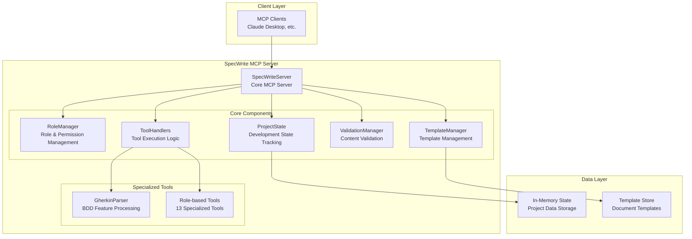
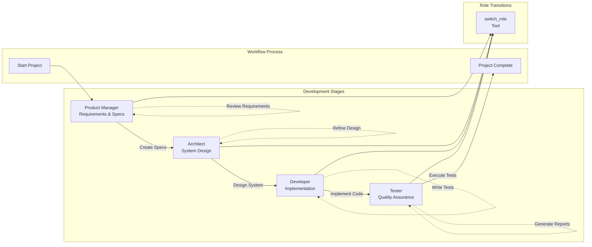

# SpecWrite-MCP

A Python implementation of a SpecWrite-MCP server that enables AI-driven, four-stage software development workflows with role-based access control and Gherkin/BDD support.

> **⚠️ Important: Build Required Before Use**
> 
> **Before using SpecWrite-MCP, you MUST build the project first:**
> 
> ```bash
> uv build
> ```
> 
> This creates the necessary wheel files that are required for the MCP server to function properly. Skipping this step will result in import errors and server failures.

## 🙏 Inspiration & Credits

This project is inspired by the excellent work on [specflow-mcp-server](https://github.com/lyz530/specflow-mcp-server) by [lyz530](https://github.com/lyz530). While the original implementation demonstrates the power of combining BDD methodologies with MCP, SpecWrite-MCP brings these concepts to the Python ecosystem with its own unique architecture and implementation approach.

### Key Differences
- **Language**: Python implementation (vs. the original's implementation)
- **Architecture**: Custom component-based design with separation of concerns
- **Features**: Enhanced role-based workflow and comprehensive validation
- **Integration**: Built specifically for Python development environments

We extend our gratitude to the original author for pioneering this innovative approach to AI-driven software development workflows.

## 🌟 Features

- **Role-based Development**: Switch between Product Manager, Architect, Developer, and Tester roles
- **Stage-based Workflow**: Follow a structured development process from requirements to testing
- **Gherkin Support**: Parse and work with Gherkin feature files for BDD scenarios
- **MCP Integration**: Works with MCP-compatible AI assistants and tools
- **State Management**: Track project progress across all development stages
- **Access Control**: Role-based permissions ensure proper workflow adherence

## 🚀 Quick Start

### Prerequisites

- Python 3.12+
- [uv](https://docs.astral.sh/uv/) for package management
- MCP-compatible AI assistant (Claude, etc.)

### Installation

```bash
# 1. Clone the repository
git clone https://github.com/cgycorey/specwrite-mcp
cd specwrite-mcp

# 2. Install dependencies
uv sync

# 3. ⚠️ CRITICAL: Build the project
uv build
```

> **🚨 IMPORTANT**: The `uv build` step is **mandatory**. This creates the wheel files needed for the MCP server to function. Without this step, the server will fail to start with import errors.

### Basic Usage

> **⚠️ REMEMBER: You must run `uv build` first!**
> 
> After building the wheels, you can run the MCP server in two ways:

#### Method 1: Direct Python Execution
```bash
# Run the MCP server
uv run python specwrite_mcp/main.py

# Run tests
uv run python tests/test_comprehensive.py

# Run basic server test
uv run python tests/test_server.py
```

#### Method 2: Using Built Wheels (Recommended)
```bash
# Run using the built wheel
uvx --with dist/specwrite_mcp-0.1.0-py3-none-any.whl python -m specwrite_mcp.main
```

### Quick Development Workflow

> **⚠️ Don't forget the build step!**
> 
> ```bash
> # 1. Install dependencies
> uv sync
> 
> # 2. 🔥 BUILD THE PROJECT (MANDATORY!)
> uv build
> 
> # 3. Run the server
> uvx --with dist/specwrite_mcp-0.1.0-py3-none-any.whl python -m specwrite_mcp.main
> 
> # 4. Run tests
> uv run python tests/test_server.py
> ```
> 
> **Remember**: Step 2 (`uv build`) is not optional. The server will not work without it!

## 👥 Development Roles & Specification Requirements

### 1. Product Manager
**Focus**: Business requirements and user stories
**Expected Outputs**: Product Requirements Documents, User Stories, Acceptance Criteria
**Deliverables**: 
- Business requirements specifications
- User story mapping and prioritization
- Acceptance criteria definition
- Success metrics and KPIs
- Market and competitive analysis
- Stakeholder requirements documentation

#### Available Tools
- `create_spec`: Create product specifications and user stories
- `review_requirements`: Review and refine requirements

#### Specification Format
```markdown
# Product Specification: [Feature Name]

## Business Value
[Describe the business value and problem being solved]

## User Stories
- As a [user type], I want [feature] so that [benefit]
- As a [user type], I want [feature] so that [benefit]

## Acceptance Criteria
- Given [context], when [action], then [outcome]
- Given [context], when [action], then [outcome]

## Success Metrics
[Define measurable success criteria]

## Dependencies
[List any dependencies or constraints]
```

### 2. Architect
**Focus**: System design and technical specifications
**Expected Outputs**: Technical Architecture, API Design, Database Design
**Deliverables**:
- System architecture diagrams and documentation
- API specifications and contracts
- Database schema designs and relationships
- Technology stack recommendations
- Security architecture designs
- Performance and scalability considerations
- Integration patterns and middleware design
- Deployment and infrastructure architecture

#### Available Tools
- `design_system`: Design system architecture
- `create_technical_spec`: Create technical specifications

#### Specification Format
```markdown
# Technical Design: [System/Component Name]

## Architecture Overview
[High-level system architecture diagram and description]

## API Design
### [Endpoint Name]
- **Method**: GET/POST/PUT/DELETE
- **Path**: /api/resource
- **Description**: [Endpoint purpose]
- **Request**: [Request schema]
- **Response**: [Response schema]
- **Authentication**: [Auth requirements]

## Database Schema
### [Table Name]
- **Columns**: [List columns with types]
- **Indexes**: [Define indexes]
- **Relationships**: [Foreign key relationships]

## Technology Stack
[Technologies, frameworks, and tools]

## Non-Functional Requirements
- Performance: [Response times, throughput]
- Security: [Security requirements]
- Scalability: [Scaling considerations]
```

### 3. Developer
**Focus**: Implementation and coding
**Expected Outputs**: Code Implementation, Unit Tests, Technical Documentation
**Deliverables**:
- Production-ready code implementations
- Comprehensive unit and integration tests
- Technical documentation and code comments
- API implementations and endpoints
- Database migrations and scripts
- Configuration and deployment scripts
- Performance optimizations
- Error handling and logging implementations
- Code reviews and refactoring

#### Available Tools
- `implement_feature`: Implement new features
- `write_code`: Write production code
- `create_tests`: Create unit and integration tests

#### Implementation Format
```markdown
# Feature Implementation: [Feature Name]

## Code Structure
```
[File path]
[Code implementation with comments]
```

## Unit Tests
```python
[Test cases with assertions]
```

## Integration Points
[API endpoints, database interactions, external services]

## Error Handling
[Exception handling and edge cases]

## Performance Considerations
[Optimization strategies and complexity analysis]
```

### 4. Tester (Testing & Validation Phase)
**Focus**: Quality assurance and testing
**Expected Outputs**: Test Plans, Test Cases, Quality Reports
**Deliverables**:
- Comprehensive test plans and strategies
- Detailed test cases and scenarios
- Test execution reports and results
- Quality metrics and KPI reports
- Bug tracking and defect reports
- Performance and load testing results
- Security testing and vulnerability assessments
- User acceptance testing (UAT) documentation
- Regression testing suites
- Test automation frameworks and scripts

#### Available Tools
- `create_test_plan`: Create comprehensive test plans
- `execute_tests`: Execute test suites
- `generate_test_reports`: Generate test reports and metrics

#### Test Plan Format
```markdown
# Test Plan: [Feature/System Name]

## Test Scope
- In Scope: [Features to be tested]
- Out of Scope: [Features not tested]

## Test Strategy
### Unit Tests
- [Components and methods to test]
- Coverage target: [%]

### Integration Tests
- [API endpoints and data flow]
- Coverage target: [%]

### System Tests
- [End-to-end scenarios]
- Coverage target: [%]

## Test Cases
### [Test Case Name]
- **Priority**: High/Medium/Low
- **Preconditions**: [Setup requirements]
- **Steps**: [Test execution steps]
- **Expected Results**: [Expected outcomes]
- **Acceptance Criteria**: [Pass/fail conditions]

## Test Environment
- [Environment setup and configuration]
- [Test data requirements]

## Exit Criteria
- [Conditions for test completion]
- [Quality gates and metrics]
```

## 🛠 Available Tools

### General Tools
- **`switch_role`**: Switch between development roles
- **`get_project_status`**: Get current project status and progress
- **`parse_gherkin`**: Parse Gherkin feature files for BDD scenarios

### Role-Specific Tools
Each role has access to tools specific to their responsibilities:

| Role | Tools | Purpose |
|------|-------|---------|
| Product Manager | `create_spec`, `review_requirements` | Define and refine requirements |
| Architect | `design_system`, `create_technical_spec` | Design system architecture |
| Developer | `implement_feature`, `write_code`, `create_tests` | Implement features and tests |
| Tester | `create_test_plan`, `execute_tests`, `generate_test_reports` | Ensure quality and test coverage |

## 📋 Example Workflow

```python
# 1. Start as Product Manager
switch_role(role="product_manager")

# 2. Create specifications
create_spec(
    title="User Authentication System",
    description="Secure user login and authentication",
    content="Users should be able to register, login, and manage accounts securely"
)

# 3. Switch to Architect
switch_role(role="architect")

# 4. Design system
design_system(
    title="Authentication Architecture",
    description="High-level system design",
    content="Microservice architecture with JWT authentication"
)

# 5. Switch to Developer
switch_role(role="developer")

# 6. Implement features
implement_feature(
    title="User Registration Endpoint",
    description="Implement user registration API",
    content="POST /api/auth/register with validation"
)

# 7. Switch to Tester
switch_role(role="tester")

# 8. Create test plan
create_test_plan(
    title="Authentication Test Plan",
    description="Comprehensive testing strategy",
    content="Unit tests, integration tests, security testing"
)

# 9. Check project status
get_project_status()
```

## 🔧 MCP Integration

### Claude Desktop Configuration

Add to your Claude Desktop `claude_desktop_config.json`:

```json
{
  "mcpServers": {
    "specwrite": {
      "command": "uvx",
      "args": [
        "--with",
        "/path/to/specwrite-mcp/dist/specwrite_mcp-0.1.0-py3-none-any.whl",
        "python",
        "-m",
        "specwrite_mcp.main"
      ]
    }
  }
}
```

### Other MCP Clients

For any MCP-compatible client, configure the server with:

```json
{
  "command": "uvx",
  "args": [
    "--with",
    "/path/to/specwrite-mcp/dist/specwrite_mcp-0.1.0-py3-none-any.whl",
    "python",
    "-m",
    "specwrite_mcp.main"
  ]
}
```

**Note**: The wheel-based approach is recommended as it ensures all dependencies are properly packaged and the server runs consistently across different environments.

## 🚨 Troubleshooting

### Common Issues

#### "ModuleNotFoundError" or "ImportError"
**Problem**: Server fails to start with import errors
**Solution**: You forgot to run `uv build`. Run this command:
```bash
uv build
```

#### "No such file or directory: dist/*.whl"
**Problem**: MCP client can't find the wheel file
**Solution**: The `dist/` directory doesn't exist. Run `uv build` to create it.

#### "Package not found" errors
**Problem**: uvx can't find the specwrite_mcp package
**Solution**: Ensure you're in the project root directory and run `uv build`.

### Quick Fix
If you're having any issues, run this complete sequence:
```bash
# Clean previous builds
rm -rf dist/ build/

# Reinstall dependencies
uv sync

# Build the project
uv build

# Try running again
uvx --with dist/specwrite_mcp-0.1.0-py3-none-any.whl python -m specwrite_mcp.main
```

## 📖 Detailed Usage

### Gherkin Integration

The server supports parsing Gherkin feature files:

```gherkin
Feature: User Authentication
  As a user
  I want to authenticate with the system
  So that I can access my account securely

  Scenario: Successful login
    Given I am on the login page
    When I enter valid credentials
    And I click the login button
    Then I should be redirected to my dashboard
```

Parse with:
```python
parse_gherkin(feature_content="...")
```

### Project State Management

The server tracks project progress across all stages:

- **Specifications**: Business requirements and user stories
- **Technical Designs**: System architecture and technical specs
- **Code Implementations**: Features, code, and tests
- **Test Plans**: Testing strategies and plans
- **Test Results**: Execution results and reports

### Role-Based Access Control

Each role can only access their specific tools:
- Product Managers cannot access development tools
- Developers cannot access architectural design tools
- Testers cannot access specification tools
- This ensures proper workflow adherence

## 🧪 Testing

### Run All Tests
```bash
uv run python test_comprehensive.py
```

### Run Basic Server Test
```bash
uv run python test_server.py
```

### Test Specific Functionality

The comprehensive test suite validates:
- ✅ All 13 tools work correctly
- ✅ Role-based access control
- ✅ Gherkin parsing
- ✅ Project state tracking
- ✅ Role switching
- ✅ MCP protocol communication

## 🏗 Architecture

### System Architecture



### Development Workflow



### Project Structure

```
specwrite-mcp/
├── main.py                    # Entry point
├── specwrite_mcp/            # Main package
│   ├── core/                # Core server functionality
│   │   ├── __init__.py
│   │   └── server.py        # MCP server implementation
│   ├── handlers/            # Tool handlers
│   │   ├── __init__.py
│   │   └── tool_handlers.py # Tool execution logic
│   ├── tools/               # Role-specific tools
│   │   ├── __init__.py
│   │   ├── role_manager.py  # Role management
│   │   └── gherkin_parser.py # BDD parsing
│   ├── state/               # Project state management
│   │   ├── __init__.py
│   │   └── project_state.py # State tracking
│   ├── utils/               # Utilities
│   │   ├── __init__.py
│   │   └── template_manager.py # Template management
│   ├── validation/          # Content validation
│   │   ├── __init__.py
│   │   └── validation_manager.py # Validation logic
│   └── __init__.py
├── tests/                   # Test files
│   ├── __init__.py
│   ├── test_server.py       # Basic server tests
│   └── test_comprehensive.py # Comprehensive tests
└── README.md                # Documentation
```

### Core Components

#### SpecWriteServer (Core Server)
- **Purpose**: Main MCP server implementation
- **Responsibilities**: 
  - MCP protocol handling
  - Tool registration and routing
  - Component coordination
- **Key Methods**: `handle_list_tools()`, `handle_call_tool()`

#### RoleManager (Role & Permission Management)
- **Purpose**: Manages development roles and access control
- **Features**:
  - Four predefined roles (Product Manager, Architect, Developer, Tester)
  - Role-based tool access control
  - Dynamic role switching
- **Key Methods**: `get_roles()`, `can_use_tool()`, `switch_role()`

#### ToolHandlers (Tool Execution Logic)
- **Purpose**: Central hub for all tool operations
- **Responsibilities**:
  - Tool registration and discovery
  - Role-based access validation
  - Tool execution routing
- **Key Methods**: `list_tools()`, `call_tool()`

#### ProjectState (Development State Tracking)
- **Purpose**: Tracks project progress across development stages
- **Features**:
  - Specification storage
  - Implementation tracking
  - Test result management
  - Progress reporting

#### GherkinParser (BDD Processing)
- **Purpose**: Processes Gherkin feature files for BDD scenarios
- **Features**:
  - Feature parsing and validation
  - Scenario extraction
  - Step analysis
  - Structured JSON output

#### ValidationManager (Content Validation)
- **Purpose**: Validates content quality and completeness
- **Features**:
  - Specification validation
  - Architecture design validation
  - Implementation quality checks
  - Test plan completeness

#### TemplateManager (Template Management)
- **Purpose**: Provides document templates for consistent output
- **Features**:
  - Specification templates
  - Architecture templates
  - Implementation templates
  - Test plan templates

## 🔍 Advanced Usage

### Custom Role Configuration

Roles and tools can be extended by modifying the role configuration in `specwrite_mcp/tools/role_manager.py`.

### State Persistence

The project state is currently in-memory. For persistence, you can extend the `ProjectState` class to add database or file storage.

### Tool Extensions

Add new tools by:
1. Adding to role configuration
2. Implementing tool logic in the server
3. Adding appropriate input schemas

## 🤝 Contributing

1. Fork the repository
2. Create a feature branch
3. Make your changes
4. Add tests for new functionality
5. Run the test suite
6. Submit a pull request

## 📄 License

MIT License - see LICENSE file for details.

## 🆘 Support

For issues and questions:
- Create an issue on GitHub
- Check the test files for usage examples
- Review the comprehensive test suite

## 🎯 Roadmap

- [ ] Persistent state storage
- [ ] Additional role types
- [ ] Enhanced Gherkin validation
- [ ] Integration with popular project management tools
- [ ] Web dashboard for project tracking
- [ ] Advanced reporting and analytics